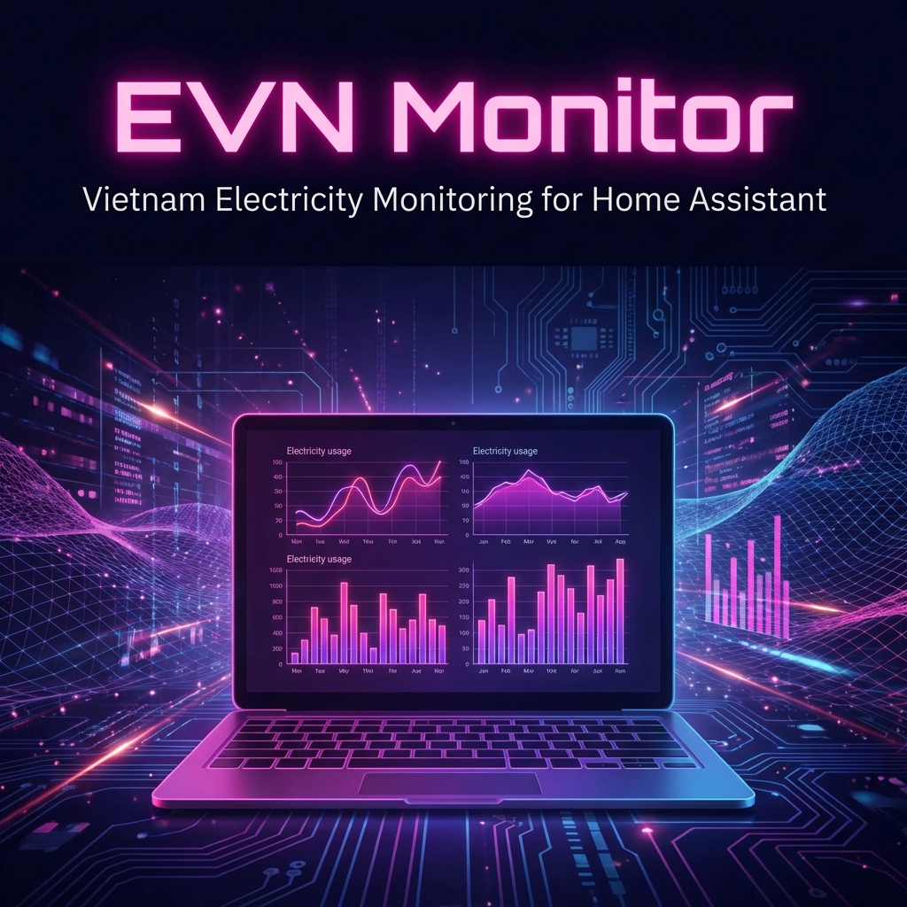
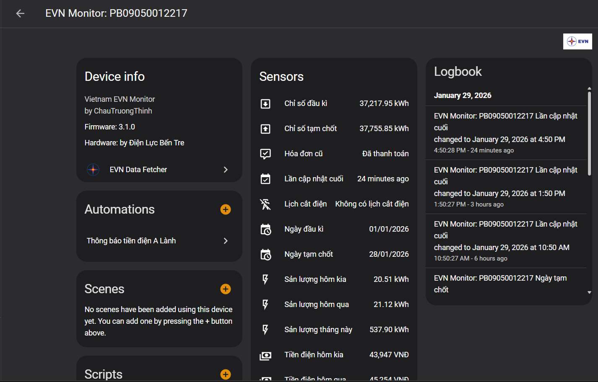
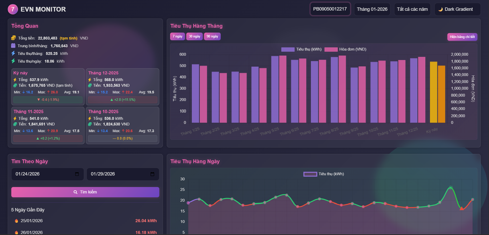
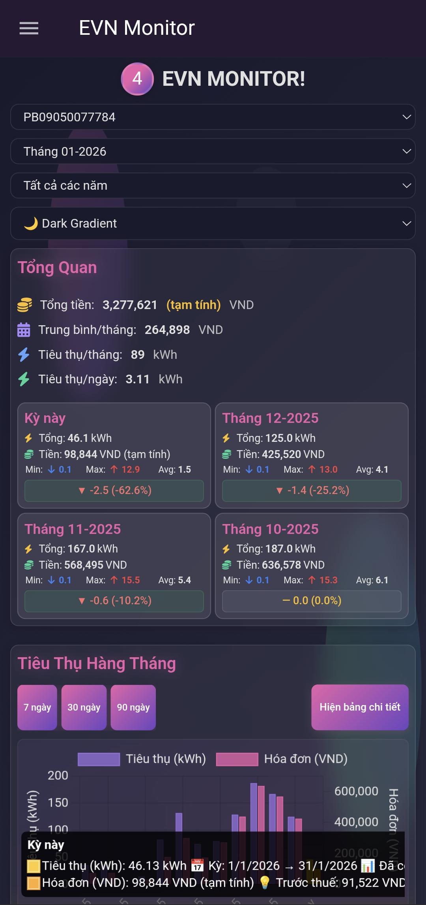
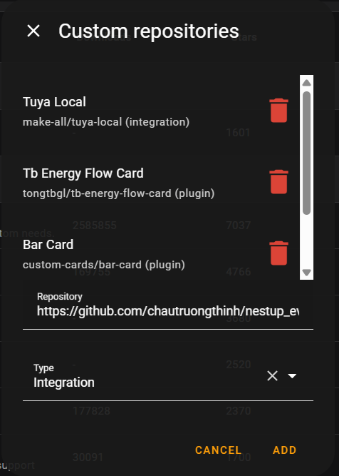

[![hacs][hacs-badge]][hacs]
[![Project Maintenance][maintenance-badge]][maintenance]
[![Code Style][black-badge]][black]

## ⚡ EVN Monitor - Theo dõi điện năng thông minh cho Home Assistant

**EVN Monitor** là integration mạnh mẽ giúp bạn theo dõi chi tiết tình hình sử dụng điện từ EVN ngay trên Home Assistant. Phiên bản mới **v3.2** mang đến trải nghiệm đột phá với **Giao diện WebUI tương tác**, hỗ trợ **Mobile PWA**, và rất nhiều tính năng mới.

#### [English Documentation](https://github.com/chautruongthinh/nestup_evn/blob/main/README_en.md) | Tiếng Việt

---

## ✨ Tính năng nổi bật

### 🖥️ Dashboard & WebUI Chuyên Nghiệp
- **Giao diện Interactive**: Biểu đồ tương tác (Chart.js) cho phép xem chi tiết từng ngày, tháng, năm.
- **Đa nền tảng**: Hoạt động mượt mà trên Desktop, Tablet và Mobile.
- **16+ Themes**: Hỗ trợ nhiều giao diện đẹp mắt (Cyberpunk, Neon, Glassmorphism, Dracula...).
- **Không cần Database**: Sử dụng công nghệ lưu trữ JSON nhẹ nhàng, không cần cài đặt MariaDB hay MySQL phức tạp.

### 📱 Mobile PWA (Progressive Web App)
- **Cài đặt như App**: Thêm vào màn hình chính điện thoại, chạy full-screen như ứng dụng native.
- **Mobile Optimized**: Thiết kế tối ưu cho cảm ứng, vuốt chạm mượt mà.
- **Widgets**: Hỗ trợ tạo widget trên màn hình chính điện thoại (iOS/Android).

### ⚡ Quản lý điện năng toàn diện
- **Đa tài khoản**: Theo dõi nhiều mã khách hàng cùng lúc.
- **Hỗ trợ toàn quốc**: Tương thích với EVN HANOI, EVN HCMC, EVN NPC, EVN CPC, EVN SPC.
- **Dữ liệu chi tiết**:
  - Sản lượng điện theo ngày, tháng.
  - Tiền điện tạm tính theo bậc thang.
  - Lịch cắt điện. (Tùy khu vực)
  - So sánh cùng kỳ năm trước.

---

## 📸 Hình ảnh

<p align="center">
  
</p>

### 🖥️ SENSOR Entities:
<p align="center">
  
</p>

### 🖥️ Desktop Dashboard
<p align="center">
  
</p>

### 📱 Mobile WebUI (PWA)
<p align="center">
  
</p>

---

## 🚀 Cài đặt

### Cách 1: Qua HACS (Khuyến nghị)
1. Vào **HACS** > **Custom repositories** > **Repository: https://github.com/chautruongthinh/nestup_evn** > **Type: Integration**.
<p align="center">
  
</p>
2. Tìm kiếm `EVN Data Fetcher` (hoặc `Nestup EVN`).
3. Nhấn **Download**.
4. Khởi động lại Home Assistant.

### Cách 2: Thủ công
1. Tải source code từ [Releases](https://github.com/chautruongthinh/nestup_evn/releases).
2. Copy thư mục `custom_components/nestup_evn` vào thư mục config của Home Assistant.
3. Khởi động lại Home Assistant.

---

## ⚙️ Cấu hình

1. Vào **Settings** > **Devices & Services** > **Add Integration**.
2. Tìm `EVN Monitor`.
3. Nhập thông tin:
   - **Mã khách hàng** (Bắt đầu bằng P...).
   - **Tài khoản & Mật khẩu** đăng nhập EVN (Website/App CSKH).
   - **Khu vực**: Chọn đúng khu vực của bạn (Hà Nội, HCMC, Miền Bắc/Trung/Nam).

---

## 📊 Sử dụng WebUI

Sau khi cài đặt, bạn có thể truy cập WebUI theo đường dẫn:

`http://<IP-HASS>:8123/evn-monitor/index.html`

### Thêm vào Dashboard (Lovelace)
Sử dụng thẻ `iframe` (Webpage Card) để nhúng giao diện vào Home Assistant:

```yaml
type: iframe
url: /evn-monitor/index.html
aspect_ratio: 100%
title: EVN Monitor
```

## ⚠️ Lưu ý quan trọng
1. **Dữ liệu có độ trễ**: Dữ liệu từ EVN thường cập nhật chậm 1-2 ngày so với thực tế (tuỳ khu vực).
2. **Tiền điện tham khảo**: Số tiền hiển thị là tạm tính theo biểu giá sinh hoạt bậc thang, có thể chênh lệch nhỏ so với hóa đơn thực tế.
3. **EVN NPC**: Do app cũ không lấy được chỉ số điện tiêu thụ mỗi ngày nên phải chuyển sang app mới. Mọi người vui lòng tải app mới rồi đăng kí tài khoản thì mới lấy được dữ liệu điện năng tiêu thụ. Link tải ứng dụng mới:

  ANDROID: https://play.google.com/store/apps/details?id=com.evn.cskh.vn&hl=vi

  OS: https://apps.apple.com/vn/app/evn-cskh/id6754793134

---

## 🤝 Đóng góp & Credits
Dự án được phát triển dựa trên nền tảng open-source và sự đóng góp của cộng đồng.

- **Tác giả**: [Chau Truong Thinh](https://github.com/chautruongthinh)
- **Contributors**: Trvqhuy, Smarthomeblack, Pham Dinh Hai, Huynh Nhat, Duong Thanh Bac, Hoang Tung V.

Nếu thấy hữu ích, hãy tặng dự án 1 ⭐️ trên GitHub nhé!
[Netsup_evn]: https://github.com/trvqhuy/nestup_evn (Bản gốc)
[hacs]: https://github.com/custom-components/hacs
[hacs-badge]: https://img.shields.io/badge/HACS-default-0468BF.svg?style=for-the-badge
[black-badge]: https://img.shields.io/badge/code%20style-black%20&%20flake8-262626.svg?style=for-the-badge
[black]: https://github.com/ambv/black
[maintenance-badge]: https://img.shields.io/badge/MAINTAINER-%40CHAUTRUONGTHINH-F2994B?style=for-the-badge
[maintenance]: https://github.com/chautruongthinh